# 软件开发环境安装指南

本文档将指导您完成 Python、VS Code 以及 Arduino IDE 的下载、安装与基础配置。

---

## 一、 Python 安装与环境配置

### 1. 下载 Python 解释器
1. 打开 Python 官方网站：<https://www.python.org/>，将鼠标悬停或点击导航栏的 **Download**。
   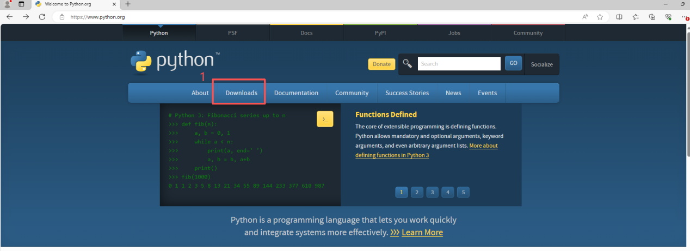
2. 在 Download 界面向下滚动，找到所需的版本号（例如选择 3.14 版本），点击对应的 **Download** 按钮。
   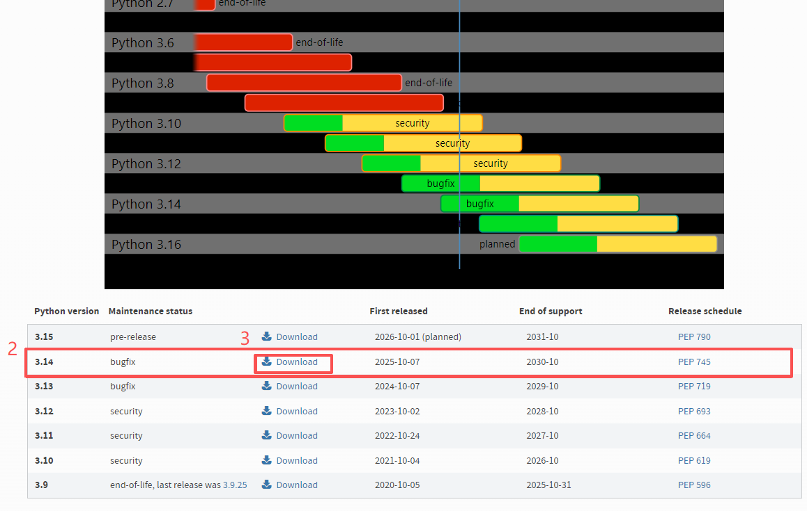
3. 随后在进入的页面向下滚动，找到 **Files** 列表中的 Windows 版本，点击 **Windows installer (64-bit)**，等待下载完成。
   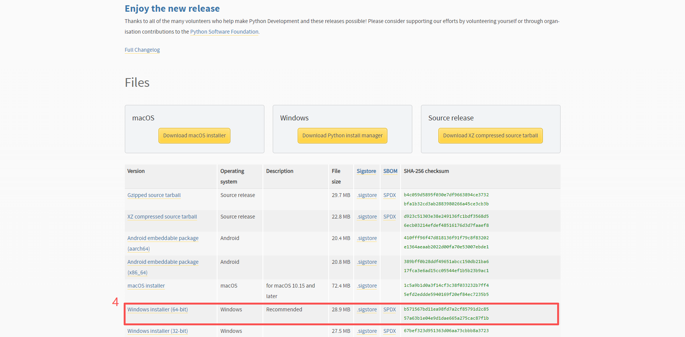

### 2. 安装 Python
1. 双击下载好的安装包，弹出安装向导。**务必勾选**底部的两个选项（特别是 `Add Python to PATH`），然后点击 **Customize installation**。
   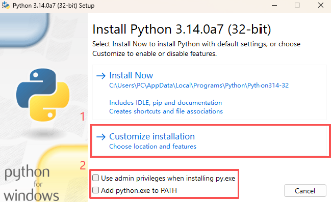
2. 确保所有的可选功能（Optional Features）都已勾选，点击 **Next**。
   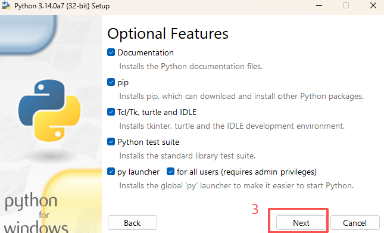
3. 在高级选项（Advanced Options）界面，勾选 **Install Python for all users**，随后点击 **Install** 进行安装，等待进度条完成。
   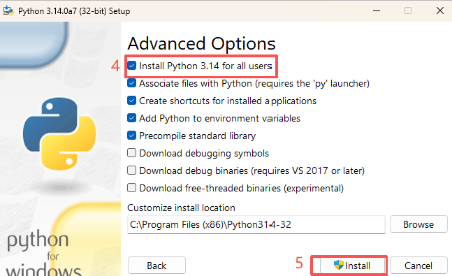

### 3. 验证安装
1. 按下快捷键 `Win + R` 打开运行窗口，输入 `cmd` 并回车打开命令提示符。
   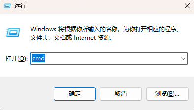
2. 在终端界面中输入以下命令：
   ```bash
   python
   ```
   如果能查看到输出的 Python 版本号，且进入了 `>>>` 交互界面，证明安装成功。
   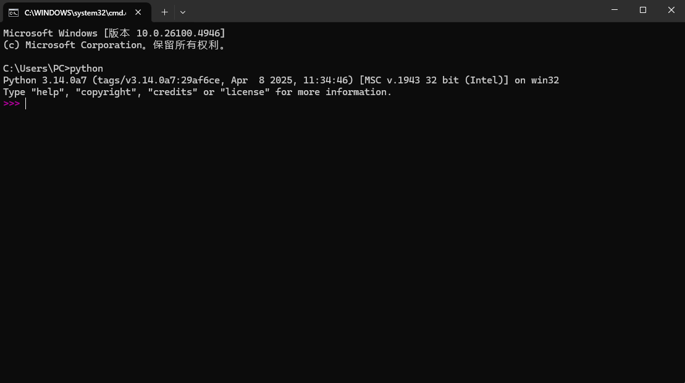

### 4. 安装依赖库
1. 重新打开一个 cmd 终端（或在刚才的终端中输入 `exit()` 回车退出 Python 交互），输入以下命令查看当前已安装的库：
   ```bash
   pip list
   ```
   > *提示：刚安装完时，列表中应该几乎没有任何第三方库。*
   > 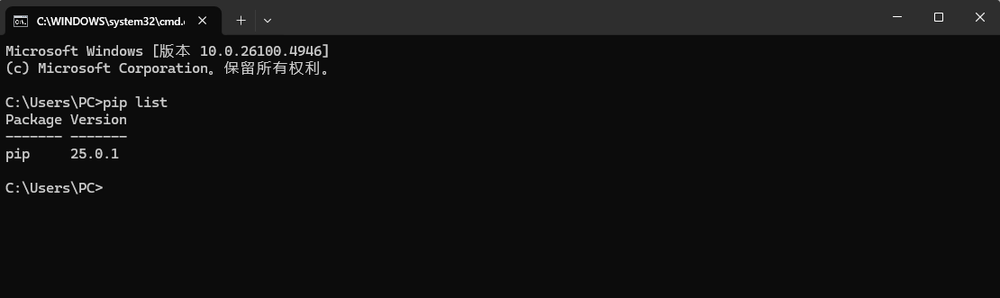

2. **安装 pyserial 库：**
   使用清华大学镜像源加速下载，输入以下指令：
   ```bash
   pip install pyserial -i [https://pypi.tuna.tsinghua.edu.cn/simple](https://pypi.tuna.tsinghua.edu.cn/simple)
   ```
   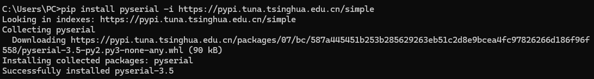
   > *出现 `Successfully installed pyserial-...` 表示安装完成。*

3. **安装 matplotlib 库：**
   为了确保 matplotlib 顺利安装，先输入指令安装 wheel 库：
   ```bash
   pip install wheel
   ```
   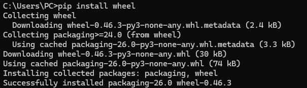
   > *出现 `Successfully installed wheel...` 代表安装成功。*
   
   接着输入指令安装 matplotlib：
   ```bash
   pip install matplotlib
   ```
   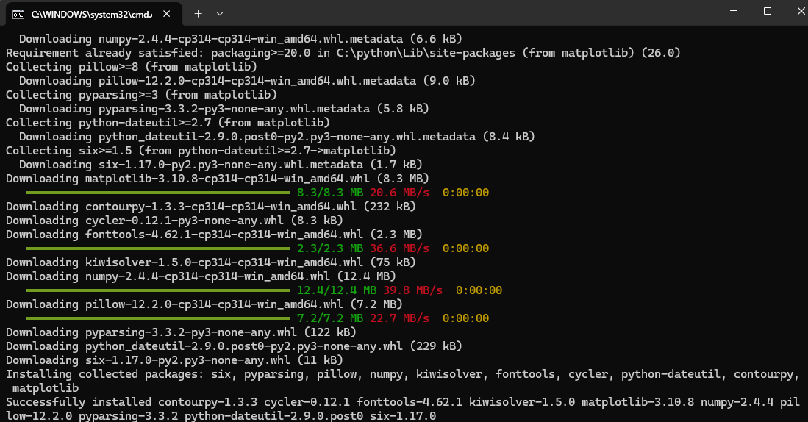
   > *显示 `Successfully installed matplotlib...` 表示安装完成。*

4. **确认库安装完毕：**
   再次输入指令检查：
   ```bash
   pip list
   ```
   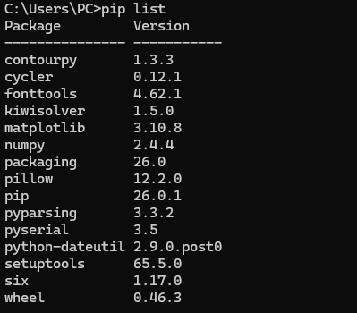
   > *在列表中看到上述安装的库，即表示所有的库安装成功。*

---

## 二、 VS Code 安装与配置

### 1. 下载 VS Code
1. 打开 VS Code 官网：<https://code.visualstudio.com/>，点击首页显眼的 **Download for Windows** 按钮，等待安装包下载完成。
   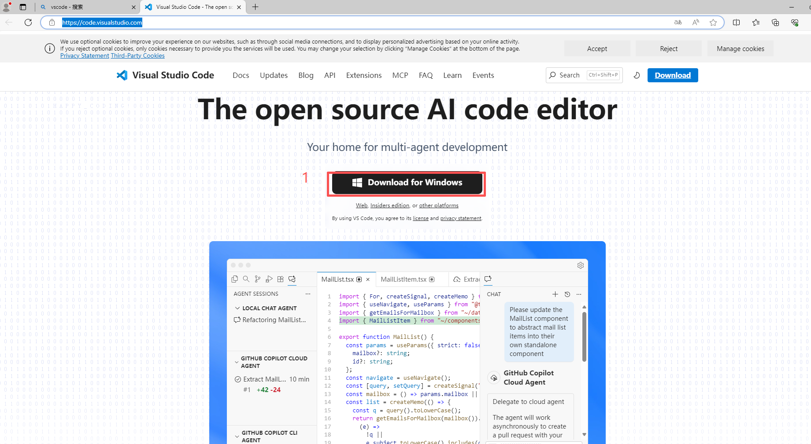

### 2. 安装过程
1. 双击下载好的安装包。
   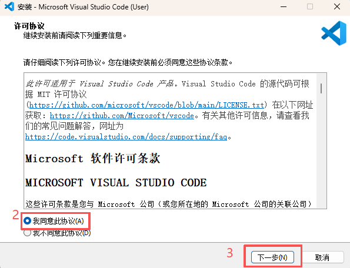
2. 接受许可协议，选择合适的安装路径，点击 **下一步**。
   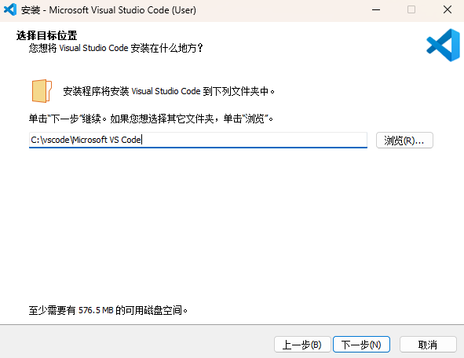
3. 确认开始菜单文件夹，点击 **下一步**。
   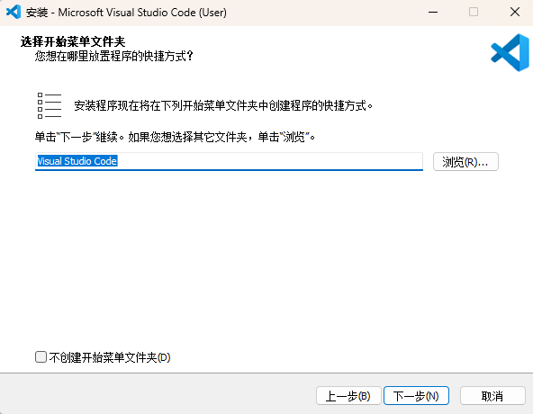
4. **强烈建议将“其他”里面的选项全部勾选**（例如“添加到右键菜单”等），点击 **下一步**，随后点击 **安装**，等待安装完成。
   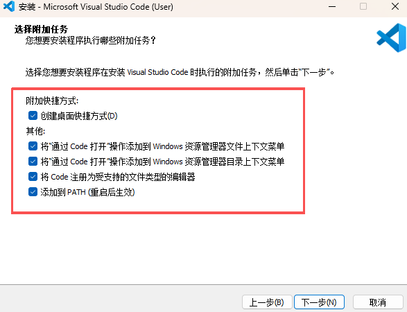

### 3. 插件安装与环境配置
1. **安装中文汉化包：**
   打开 VS Code，点击左侧活动栏的第四个图标（扩展/Extensions），在搜索框中输入 `Chinese`。找到中文（简体）语言包，点击 **Install（安装）**。
   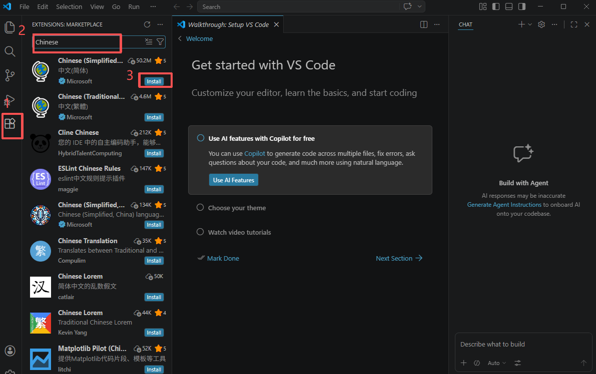
   下载好之后，右下角会弹出提示，点击 **Change Language and Restart**（更改语言并重启），完成汉化。
   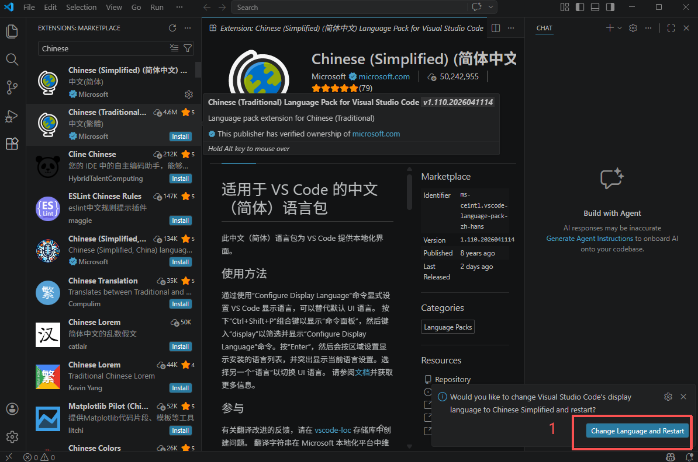

2. **配置 Python 环境：**
   再次进入扩展商店，在搜索框中输入 `Python`，找到由 Microsoft 官方提供的第一个插件，点击 **安装** 即可。
   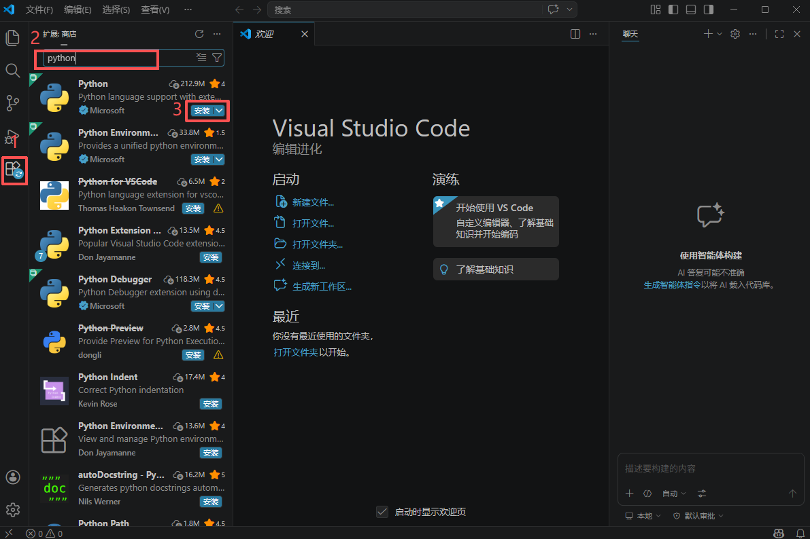

---

## 三、 Arduino IDE 安装

### 1. 下载 Arduino IDE
1. 前往 Arduino 官方下载页面：<https://www.arduino.cc/en/software/>。
2. 找到对应的版本（例如 Windows Win 10 and newer, 64 bits），点击 **DOWNLOAD**（如果弹出捐赠页面，可选择 JUST DOWNLOAD）。
   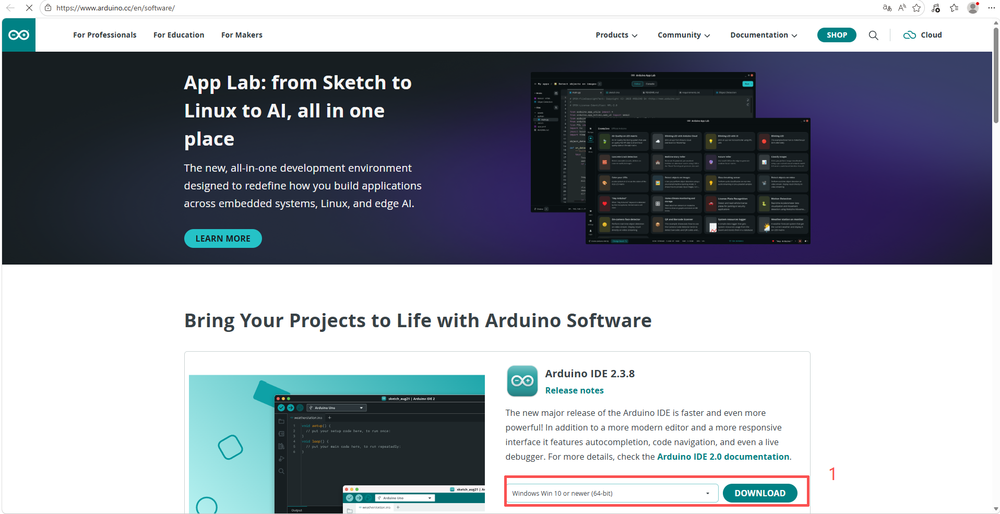

### 2. 安装与驱动配置
1. 双击运行安装程序，依次点击 **我同意**、**下一步**。选择好合适的安装路径后，点击 **安装**。
   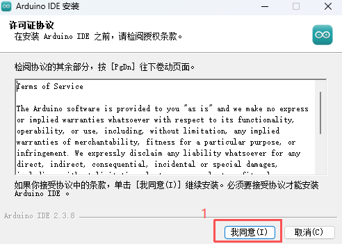 
   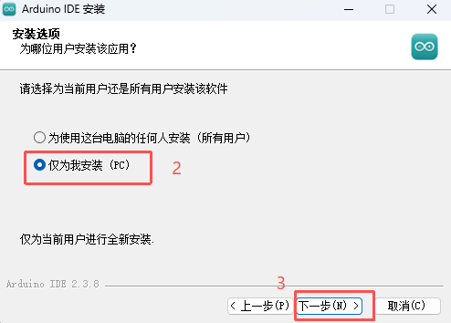 
   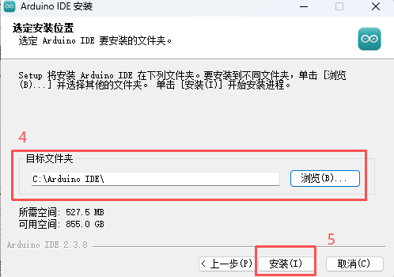
2. 安装完成后打开 Arduino IDE。**注意：** 初次运行或连接设备时，系统若多次弹出“安装设备软件”或“驱动程序”的提示，请务必全部点击 **安装**。
   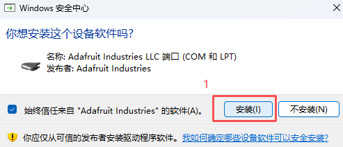
   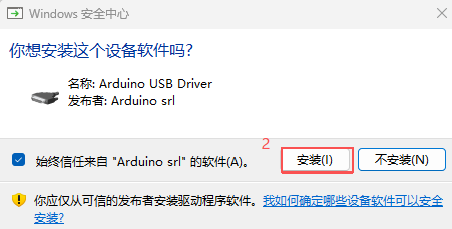 
   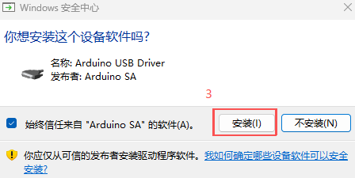 
   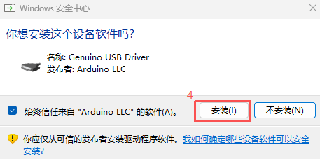